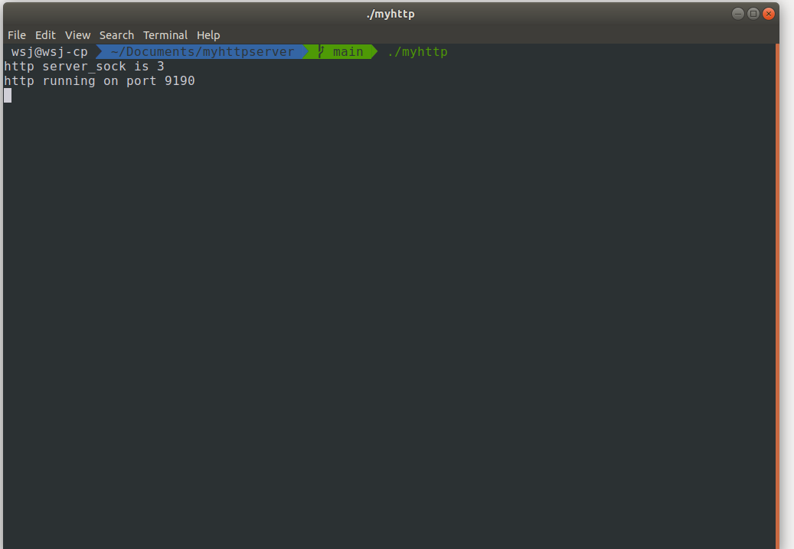
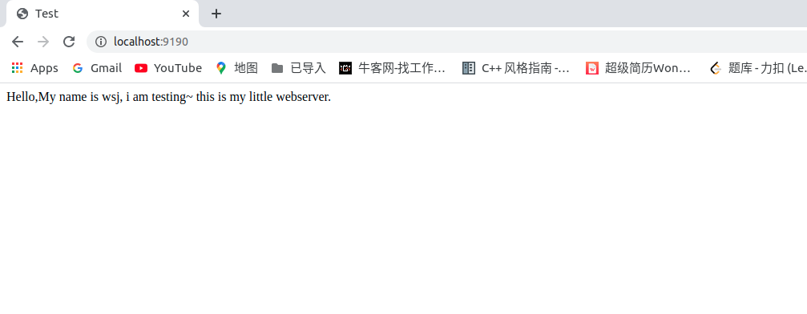
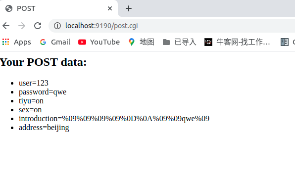
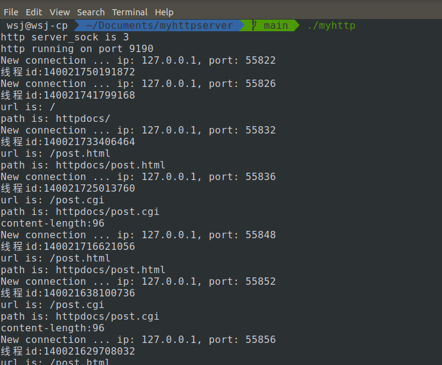

## Introduction

本项目为基于Tinyhttpd实现的多线程并发HTTP服务器，可处理get、post请求，支持静态资源访问和动态消息回显。

程序都做了详细的注释，便于阅读。

## Environment

* OS: Ubuntu18.04
* Complier: gcc 8.4.0

# Build

gcc -W -Wall -o myhttp myhttp.c -lpthread

默认端口号为9190

# 演示

**启动服务器**

**输入url **

**输入表单**

**信息回显**

# 参考

https://github.com/forthespada/MyPoorWebServer

https://www.jianshu.com/p/18cfd6019296

https://www.cnblogs.com/qiyeboy/p/6296387.html